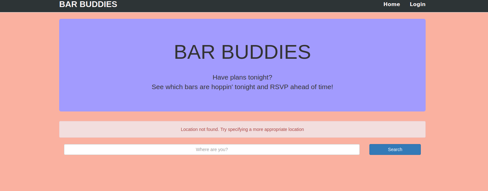

# Nightlife-Coordination-App
A nightlife coordination app by which anyone can see how many people are going on a bar tonight.  
  
See it in action on [Heroku](https://kunal-nightlife-app.herokuapp.com)  
To try on your system -  
Clone or download this repository.  
Navigate to this repository using terminal and run `npm install` to install all the dependencies.  
Run `node app` to start the server.  
navigate to `http://localhost:3000/` in your browser.  
  
Check out the video below    
 

### After adding some styling :

  
### User Stories  
  
1. As an unauthenticated user, I can view all bars in my area.  
  
2. As an authenticated user, I can add myself to a bar to indicate I am going there tonight.  
  
3. As an authenticated user, I can remove myself from a bar if I no longer want to go there.  
  
4. As an unauthenticated user, when I login I should not have to search again.  
  
Thanks for taking a look!  
